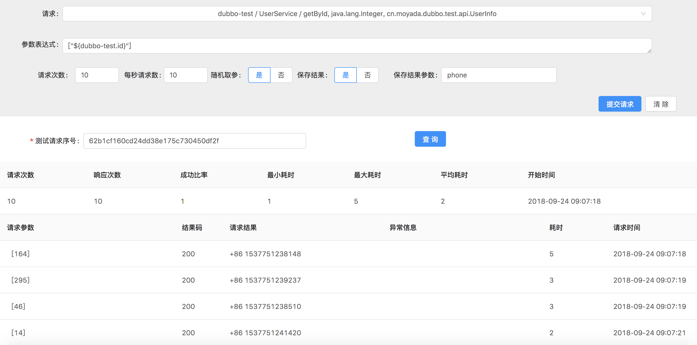
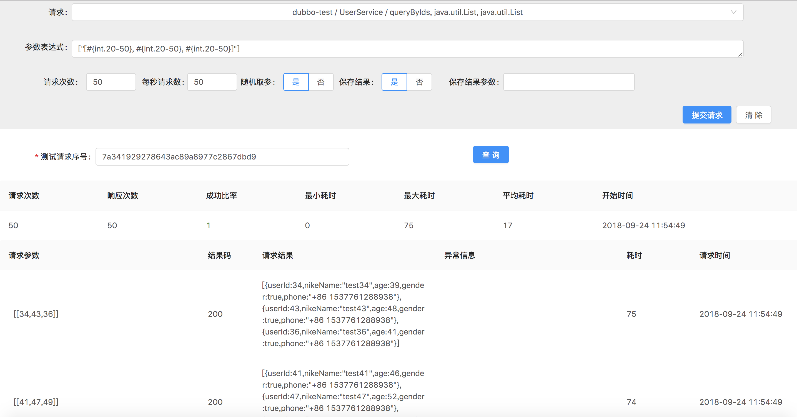
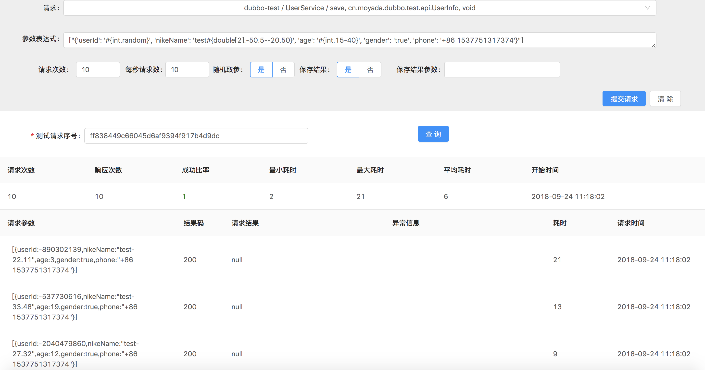

## Sharingan

## 简介
sharingan 是用来快速检测回归RPC服务`可用性`的Java工程。
在项目快速迭代时期，由于工期紧凑、逻辑复杂、测试覆盖范围不全等原因程序中往往可能存在疏忽的各种问题。
通过定义`参数表达式`对服务进行模拟调用，生成测试报告，检测程序中可能存在的各种异常。

## 功能特性

* 动态类加载，无需引入依赖jar包，运行期从版本仓库中获取最新依赖，隔离不同项目依赖。

* 参数表达式，根据配置规则动态生成请求参数。
  例如，领域数据表达式: `${test.data}`、随机整数表达式: `#{int.random}`、范围浮点数表达式: `#{double[3].-50.5-300.8}`

* rpc协议支持，目前支持[Dubbo](http://dubbo.apache.org/)、[Spring Cloud](http://projects.spring.io/spring-cloud/)。

* 监听项目接口调用，对运行项目引入agent，生成项目领域数据，将请求的数据保存用于参数表达式使用。(开发中)


## 快速开始

1. 项目需要`jdk1.8`以上版本，通过[这里](https://github.com/moyada/sharingan/releases)下载 sharingan-manager 压缩包进行解压。

2. 初始化mysql数据库，执行`schema`文件下的`info.sql`和`invoke.sql`。

3. 对`conf.properties`文件进行配置:

```
# nexus3仓库地址
maven.host = http://127.0.0.1:8081

# mysql连接信息
spring.datasource.url = jdbc:mysql://127.0.0.1:3306/sharingan?useSSL=false&useUnicode=true&amp&characterEncoding=UTF-8
spring.datasource.username = root
spring.datasource.password = root

# SpringCloud 注册地址
eureka.client.serviceUrl.defaultZone = http://127.0.0.1:8761

# dubbo注册中心
dubbo.registry = zookeeper://127.0.0.1:2181
dubbo.username =
dubbo.password =

```
4. 启动sharingan: `./run.sh`

5. 访问链接 `htto://127.0.0.1:8080/index.html` 进入管理界面。


## 使用指南

* 动态进行类加载: 通过`MetadataRepository`查找`AppDO`来获取项目的仓库坐标，从版本仓库中获取最新依赖。

* 领域数据表达式: `MetadataRepository`查询的`FunctionDO`中`expression`字段来指定规则动态生成请求参数，表达式格式为`${项目名称.数据领域}`。
  mysql中，项目名称为`app_info`表中的`name`、数据领域为`invoke_param`中的`domain`。

* 数值表达式: 默认带有整数和浮点数的生成表达式，
整数表达式: 可设置随机范围`#{int.开始-结束}`，或者无范围`#{int.random}`。
浮点数表达式: 可设置随机范围`#{double[精度].开始-结束}`，或者无范围`#{double.random}`，对于`[精度]`设置可选，缺省为3。

## 示例
测试数据位于`schema`文件下的`test.sql`。

### 常量


### 领域表达式


### 数值表达式


### 复合表达式
