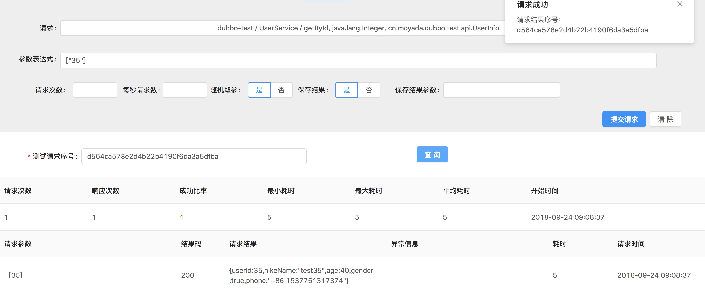

Sharingan
---------------

sharingan 是用来快速检测回归RPC服务 `可用性` 的Java工程。
在项目快速迭代时期，由于工期紧凑、逻辑复杂、测试覆盖范围不全等原因程序中往往可能存在疏忽的各种问题。
通过定义 `参数表达式` 对服务进行模拟调用，生成测试报告，检测程序中可能存在的各种异常。

## 功能特性

* 动态类加载，无需引入依赖 jar 包，运行期从版本仓库中获取最新依赖，隔离不同项目依赖。

* 参数表达式，根据配置规则动态生成请求参数。
  例如，领域数据表达式: `${test.data}`、随机整数表达式: `#{int.random}`、范围浮点数表达式: `#{double[3].-50.5-300.8}`

* rpc协议支持，目前支持 [Dubbo](http://dubbo.apache.org/)、[Spring Cloud](http://projects.spring.io/spring-cloud/)。

* 监听服务调用，通过对目标 class 生成镜像修改，监控方法调用。(注: 增加元类空间占用)

## 如何使用

1. 项目需要 `jdk1.8` 以上版本，通过 [这里](https://github.com/moyada/sharingan/releases) 下载 sharingan-manager 压缩包进行解压。

2. 初始化mysql数据库，执行 `schema` 文件下的 `info.sql` 和 `invoke.sql` 。

3. 对 `conf.properties` 文件进行配置:

| 参数 | 描述 |
| --- | ---- |
| sharingan.datasource.url | mysql 连接地址 |
| sharingan.datasource.username | mysql 连接用户名 |
| sharingan.datasource.password | mysql 连接密码 |
| sharingan.maven.registry | nexus3 仓库地址(可选) |
| sharingan.maven.username | nexus3 仓库账号(可选) |
| sharingan.maven.username | nexus3 仓库密码(可选) |
| sharingan.rpc.dubbo.registry | dubbo 注册中心地址(可选) |
| sharingan.rpc.dubbo.username | dubbo 注册中心账号(可选) |
| sharingan.rpc.dubbo.password | dubbo 注册中心密码(可选) |
| sharingan.rpc.springcloud.registry | SpringCloud-eureka 注册地址(可选) |

4. 启动sharingan: `./run.sh`

5. 访问链接 `htto://127.0.0.1:8080/index.html` 进入管理界面。

6. 调用采集

要求项目使用 Spring-Boot (建议版本 2.x.x+)，将 `sharingan-instrument-spring` 配置 Monitor 后打包引入，以注解形式监控数据。

具体步骤

6.1. 创建 Monitor 实例，配置 sharingan-instrument-spring 下 pom.xml 中 sharingan-monitor 具体依赖。

##### 示例: 在 LocalMonitorAutoConfiguration 或 SharinganMonitorAutoConfiguration 中配置自动装配。

```

@Bean
public Monitor monitor() {
    return new TestMonitor();
}


<-- 在 pom.xml 中引入 sharingan-monitor-local -->
<dependencies>
    <dependency>
        <groupId>cn.moyada</groupId>
        <artifactId>sharingan-monitor-local</artifactId>
    </dependency>
</dependencies>

```

6.2. 引入 sharingan-instrument-spring 依赖并配置参数

```
sharingan.enable = true
sharingan.application = test
```

6.3. 对接口进行监控配置，依赖注入形式必须为 `@AutoWrie 接口 service;`

| 注解 | 描述 |
| --- | ---- |
| @Listener | 选择监控对象，用于类或接口上 |
| @Catch | 选择监控方法 |
| @Rename | 对方法参数重命名 |
| @Exclusive | 排除方法参数 |

##### 示例

```
@Listener(domain = "test", protocol = RpcProtocol.DUBBO)
public interface Interface1 {

    @Catch
    void reportData(@Rename("name") String value, @Exclusive boolean flag);
}

@Component
public class Class1 implements Interface1 {

    void reportData(String value, boolean flag) {
        System.out.println(value + flag);
    }
}

================

@AutoWire
Interface1 service;


```


## 操作解释

* 动态进行类加载: 在非 http 调用时，通过 `MetadataRepository` 查询的 `AppDO` 获取项目的仓库坐标，从版本仓库中获取最新依赖，
同时时卸载过期类加载器。

* 领域数据表达式: `MetadataRepository` 查询的 `FunctionDO` 中 `expression` 字段来指定规则动态生成请求参数，表达式格式为 `${项目名称.数据领域}` 。
  默认mysql实现中，项目名称为 `app_info` 表中的 `name` 、数据领域为 `invoke_param` 中的 `domain` 。

* 数值表达式: 默认带有整数和浮点数的生成表达式，
整数表达式: 可设置随机范围 `#{int.开始-结束}` ，或者无范围 `#{int.random}` 。
浮点数表达式: 可设置随机范围 `#{double[精度].开始-结束}` ，或者无范围 `#{double.random}` ，对于 `[精度]` 设置可选，缺省为 3。

## 案例展示
测试数据位于 `schema` 文件下的 `test.sql` 。

### 常量


### 领域表达式


### 数值表达式


### 复合表达式
